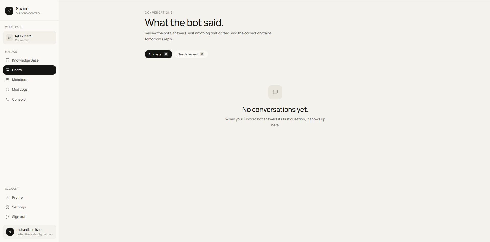
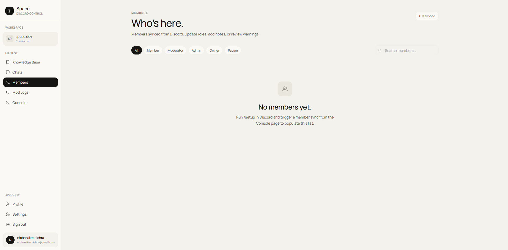
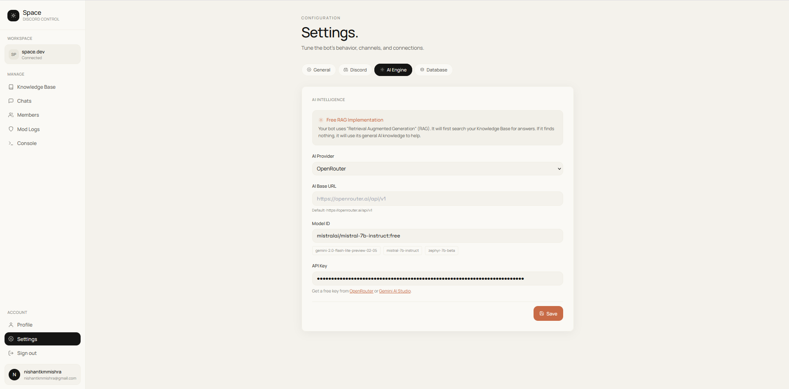

# Space Studio

Orchestrate AI-enhanced Discord community operations with precision through a centralized management studio.

---

## Overview

Space Studio is a production-grade administrative dashboard designed for governing Discord bot instances with integrated Retrieval-Augmented Generation (RAG) capabilities. By providing a human-in-the-loop audit layer, it enables community operators to curate knowledge bases, monitor real-time conversations, and refine AI reasoning to ensure high-fidelity interactions.

---

## Architecture

The application follows a Service-Oriented Architecture (SOA) implemented with React 18 and Vite. It enforces a strict separation between the view layer and business logic to ensure scalability and testability.

### Technical Specifications
- **Framework**: React 18 + Vite
- **Data Orchestration**: TanStack Query v5 + Zustand
- **Persistence**: Supabase (PostgreSQL)
- **Security**: Row Level Security (RLS) + Authenticated Service Layers
- **Real-time**: Supabase Broadcast + Server-Sent Events (SSE)

---

## Key Modules

### Knowledge Orchestration
Manage the source material for the RAG engine. Curate documents, edit passages in real-time, and observe as the bot's contextual awareness adapts instantly.


### Conversation Audit & Refinement
Review live bot-user interactions. The refinement interface allows operators to flag drifting logic and update responses, creating a feedback loop that improves future AI accuracy.


### Community Governance
A unified registry for member management. Track user behavior, manage roles, and maintain an immutable ledger of administrative interventions and moderation events.


### Infrastructure Configuration
Granular control over neural model parameters, AI providers (OpenRouter, OpenAI, Groq), and Discord integration endpoints.


---

## Project Structure

```text
├── apps/dashboard/         # Vite-based management interface
├── docs/assets/            # UI documentation and technical assets
├── supabase/
│   ├── schema.sql          # Database table definitions
│   └── policies.sql        # Row Level Security (RLS) configuration
└── package.json            # Workspace and dependency management
```

---

## Setup and Installation

### Prerequisites
- Node.js v18.0.0+
- NPM v9.0.0+
- A Supabase project instance

### Installation
1. Clone the repository and install dependencies:
   ```bash
   git clone https://github.com/nishantkmmishra/spacebot.git
   cd spacebot
   npm install
   ```

2. Initialize the database by executing the scripts in `/supabase` via the Supabase SQL Editor.

### Local Development
```bash
npm run dev
```

---

## Environment Configuration

Configuration is managed via `.env.local` in `apps/dashboard/`.

| Variable | Description |
| :--- | :--- |
| `VITE_SUPABASE_URL` | Supabase project endpoint |
| `VITE_SUPABASE_ANON_KEY` | Supabase anonymous API key |
| `VITE_BOT_API_URL` | Endpoint for the companion bot instance |
| `VITE_BOT_API_SECRET` | Authentication secret for secure bot communication |

---

## Security and Persistence

Space Studio prioritizes data integrity and secure access.
- **Secret Management**: All AI provider keys and database secrets are managed via environment variables and never exposed to the client-side bundle.
- **Row Level Security**: Every database table is protected by Supabase RLS policies, ensuring that authenticated users only access authorized guild data.
- **Audit Trails**: All administrative actions are recorded in a persistent moderation log for accountability.

---

## License

Distributed under the MIT License. See `LICENSE` for more information.

---

Copyright © 2026 Operational Intelligence. Maintained by Nishant Kumar Mishra.
