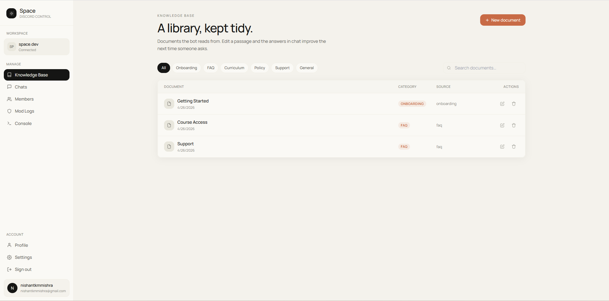
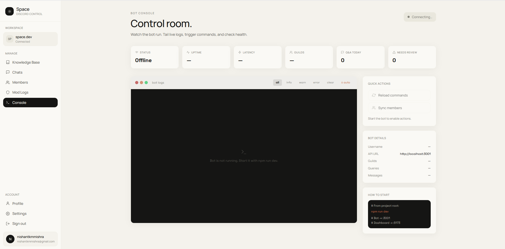
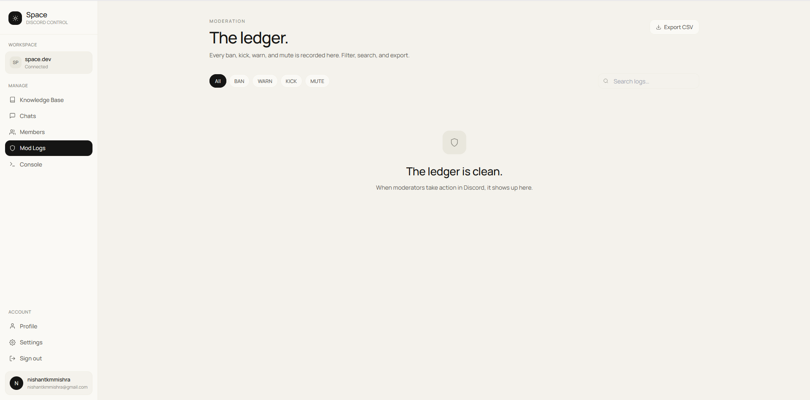
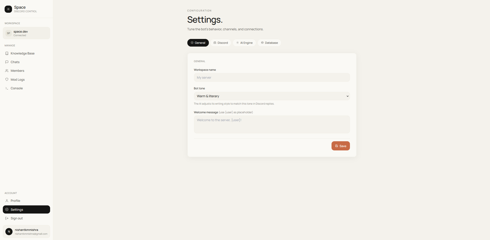

# 🌌 Space Dashboard

> [!IMPORTANT]
> **Project Under Construction**
> This project is currently in active development. The Discord bot component is under construction; currently, only the **Space Studio Dashboard** is available for management and configuration.

Space is a premium, AI-powered management studio for Discord communities. It provides a literary, high-fidelity interface for managing knowledge bases, monitoring bot activity, and configuring AI behaviors.

---

## ✨ Features

### 📚 Knowledge Base
Manage the documents your bot reads from. Edit, categorize, and search through your community's library to ensure the AI always has the right answers.


### 💬 Conversation Insights
Review what your bot is saying in real-time. Edit drifted answers to train the AI for better future responses.


### 🛠️ Control Room
A centralized console to monitor bot health, view live logs, and trigger administrative commands.


### 👥 Member & Moderation Management
Sync members directly from Discord, update roles, and maintain a clean ledger of all moderation actions.



### ⚙️ Advanced Configuration
Tune your bot's tone, select AI models (via OpenRouter/Gemini), and manage your database connections with ease.



---

## 🛠️ Tech Stack

- **Frontend**: [React 18](https://reactjs.org/) + [Vite](https://vitejs.dev/)
- **Styling**: [Tailwind CSS](https://tailwindcss.com/)
- **Components**: [Radix UI](https://www.radix-ui.com/) + [Shadcn UI](https://ui.shadcn.com/)
- **Database & Auth**: [Supabase](https://supabase.com/)
- **Icons**: [Lucide React](https://lucide.dev/)
- **Monorepo**: [Turborepo](https://turbo.build/)

---

## 🚀 Getting Started

### 1. Prerequisites
- Node.js (v18+)
- NPM (v9+)

### 2. Installation
```bash
# Install dependencies
npm install
```

### 3. Environment Setup
Create an `.env.local` file in `apps/dashboard/` and provide your Supabase credentials:
```bash
VITE_SUPABASE_URL=https://your-project.supabase.co
VITE_SUPABASE_ANON_KEY=your-anon-key
```

### 4. Database Setup
1. Create a new project at [Supabase](https://supabase.com).
2. Execute the `supabase_schema.sql` and `supabase_rls_policies.sql` files in the Supabase SQL Editor.

### 5. Launch
```bash
# Run the dashboard in development mode
npm run dev
```

---

## 📂 Project Structure
```text
.
├── apps/
│   └── dashboard/        # React + Vite Management Studio
├── docs/
│   └── screenshots/      # UI Documentation Images
├── supabase_schema.sql   # Database Table Structures
├── supabase_rls_policies.sql # Security & Privacy Rules
├── package.json          # Monorepo Workspace Config
└── GARANT.md             # Detailed System Architecture
```

---

## 📜 System Guide
For a deep dive into the code structure, connections, and roadmap, please refer to the [GARANT.md](./GARANT.md) file.
